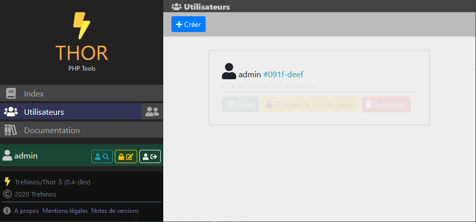
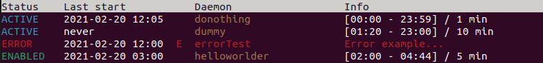

# Thor

**Thor** is designed as a PHP *framework* as well as a web *software*.  
This project's goal is to provide a base project for **PHP developers** to develop corporate projects.

**This project is still in active development** : public API may change, but tagged versions are usable as is.  
**In further releases, the installation process will be simplified.**

&copy; 2020-2021 Trehinos

## Key features

* Complete but lightweight framework :
    * Smart databases utility classes :
        * **PdoExtension** : Connection handler, requester, transaction.
        * **PdoTable** :
            * ```CrudHelper``` : performs CRUD operations on DB,
            * ```SchemaHelper``` : performs DQL operations on DB,
            * ```BasePdoRow```/```PdoRowTrait```/```PdoRowInterface``` : models to create DAOs with CrudHelper :
            * attributes ```#[PdoRow]```, ```#[PdoIndex]```, ```#[PdoColumn]```, ```#[PdoForeignKey]```.
    * Http cycle handling : **Router and controllers** (attribute ```#[Route]```).
    * **CLI commands** handling, console color/formatting utility.
    * Static **logger** and **configuration**.
    * **Twig** template system.
    * **Multilingual** static and **dynamic** strings (```_``` global Twig variable and ```|DICT()``` filter).
    * Extensible application with **kernels**.
* Base **web application** to develop a corporate work :
  
    * Index, legal, about and changelog pages.
    * **Menu** system with icons.
    * Page loading in **AJAX** (reduced payload).
    * **Users** management (create/edit/change password/delete), login, logout.
* Console commands to **control the application** :
    * ```user/``` : ```create``` / ```edit``` / ```delete``` / ```list```.
    * ```core/``` : ```setup```.
    * ```clear/``` : ```cache``` / ```logs```.
    * ```route/``` : ```set``` / ```list```.
* Daemons and daemons control (e.g. ```daemon/status -all``` command) :  
  
    * ```start``` / ```stop``` : enable or disable a daemon.
    * ```kill``` / ```reset``` : stop execution or reset state.

*more to come in new versions*

## Dependencies

### Environment

* GNU/Linux or Windows system. Works on VMs/XAMPP.
* PHP 8.1 + PDO + DBMS PDO drivers
* PHP-EXT ```calendar``` ```curl``` ```ftp``` ```pdo``` ```ssh2``` ```zip``` ```ldap```
* PDO compatible DBMS
* HTTP server
* Composer

### Server-side vendors

#### Installed with ```composer update```

* Symfony/VarDumper 5.3
* Symfony/Yaml 5.3
* Twig/Twig 3.3
* NuSphere/NuSoap 0.9.6
* Datatables/Editor 2.0.5
* PhpOffice/PhpSpreadsheet 1.19

### Web vendors (not included)

* [JQuery 3.5.1](https://code.jquery.com/jquery-3.5.1.min.js)
* [Popper 1.16](https://cdn.jsdelivr.net/npm/popper.js@1.16.0/dist/umd/popper.min.js)
* [Fontawesome 5.13.1](https://fontawesome.com/) PRO icons **licence required**
* [Bootstrap 5.1](https://getbootstrap.com/docs/5.1/getting-started/introduction/)

## Thor setup

### Basic installation :

1. **Download** and unzip or **clone** the project. Say it has been copied in ```thor/```,
2. Go to ```thor/``` in a terminal and type ```composer update``` to **install dependencies**,
3. **Set configuration** in```thor/app/res/config/config.yml```.

### Database installation :

4. **Initialize the database** :
   * **Create the database** or retrieve DB infos,
   * **edit** ```thor/app/res/config/database.yml```, then :
   * **run** ```php thor/bin/thor.php core/setup``` in a terminal.

### If you use Thor as a web application :

5. **Create a virtualhost** which has ```thor/web/``` as *DocumentRoot*,
6. **Edit permissions** : ```thor/var/cache``` and ```thor/var/logs``` have to be writable and ```thor/web``` readable
   for the user who runs **PHP** (usually ```www-data```),
7. **Download** and copy **web vendors** :
    * Fontawesome ```all.min.js``` in ```thor/web/assets/fontawesome/js/all.min.js```,
    * ```bootstrap.min.js``` in ```thor/web/assets/bootstrap/js/bootstrap.min.js```,
    * ```bootstrap.min.css``` in ```thor/web/assets/bootstrap/css/bootstrap.min.css```.

## Documentation

Link : [Documentation](docs/SUMMARY.md)

## Releases notes

### ```0.9``` OMEGA (RC) "Thor 2"

* PHP 8.1
* PSR compliance and implementation :
  * ```PSR-3``` Logger
  * ```PSR-4``` Auto-loading (with **composer**)
  * ```PSR-7``` HTTP Message
  * ```PSR-12``` Code Style
  * ~```PSR-11``` Container (is a Composite)
  * ```PSR-15``` HTTP Handler
  * ```PSR-16``` SimpleCache (*in memory* implementation)
  * ```PSR-18``` HTTP Client

#### Framework

* **Http module** refactor
* **Security module** refactor
* **Debug module** refactor

#### Web

* Updated **vendors**

### ```0.4``` DELTA

#### Framework

* ```Thor\Thor``` class
* Custom kernels
* Dynamic lang strings

#### API/Cli

* ```clear/cache``` and ```clear/logs``` commands

### ```0.3``` GAMMA

#### Framework

* **PdoTable** : CrudHelper and attributes : ```#[PdoRow]```, ```#[PdIndex]```, ```#[PdoColumn]```
  , ```#[PdoForeignKey]```
* **Router attribute** : ```#[Route]```

#### API/Web

* ```page-base.twig.html``` page template

#### API/Cli

* ```core``` commands (```setup```, ```route/list```, ```route/set```)
* daemons (```start```, ```stop```, ```kill```, ```reset```, ```status```)

### ```0.2``` BETA

#### Framework

* PHP8.0
* CliKernel
* Security module

#### API/Web

* Ajax page loading and JS ```menuClick()```
* users can change their password
* delete user action

#### API/Web

* User commands

### ```0.1``` ALPHA

#### Framework

* Kernels, application, entry points
* PdoExtension (PdoHandler, PdoRequester)
* HttpKernel
* Logger

#### API/Web

* user login/logout
* list users, create user, edit user

## License

License : [MIT](LICENSE)  
&copy; 2021 Sébastien Geldreich
