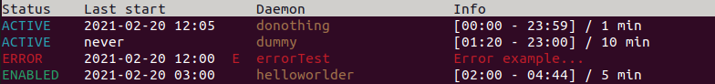

# THOR &gamma;-dev
**Thor** is designed as a PHP *framework* as well as a web *software*.  
This project's goal is to provide a base project for business projects.

**This project is still in development. Further releases installation process will be
simplified.**

&copy; 2020-2021 Trehinos

## Key features
* Complete but lightweight framework :
  * Smart databases utility classes (PdoExtension, PdoRow (with **PHP attributes**))
  * Http cycle handling : Router and controllers (with **PHP attributes** or YAML)
  * CLI commands handling, console color/formatting utility
  * Static logger and configuration
  * Twig template system
* Base web application to develop a business work :
  * Index, legal, about and changelog pages
  * User management (create/edit/change password/delete), login, logout
* Console commands to control application
  * ```user/``` : ```create``` / ```edit``` / ```delete``` / ```list```
  * ```core/``` : ```setup```
  * ```route/``` : ```set``` / ```list```
* Daemons and daemons control (e.g. ```daemon/status -all``` command) :  

  * start/stop
  * kill/reset

## Dependencies
### Environment
* Pdo compatible DBMS
* HTTP server
* PHP 8.0 / Pdo / DBMS PHP drivers
* Composer

### Vendors
*Installed with ```composer update```* :
* Symfony/VarDumper 5
* Symfony/Yaml 5
* Twig 3

*To download and set up separately* :
* Fontawesome PRO icons (min version 5.13.1)  
  *You can use the free version, but some icons are not going to work without modifications*.
* Bootstrap 4.5

## THOR setup
1. Download the project and unzip it. Say it has been unzipped in ```thor/```.
2. Go to ```thor/``` in a terminal and type ```composer update```.
3. Launch ```thor/engine/sql/setup.sql``` in an SQL environment to set up Thor DB (**mimir**) and edit ```thor/engine/config/database.yml```.
4. Create a virtualhost which has ```thor/web/``` as *DocumentRoot*.
5. Copy fontawesome ```all.min.js``` in ```thor/web/assets/fontawesome/js/all.min.js```
6. Copy ```bootstrap.min.js``` in ```thor/web/assets/bootstrap/js/bootstrap.min.js```
7. Copy ```bootstrap.min.css``` in ```thor/web/assets/bootstrap/css/bootstrap.min.css```
8. The user who runs PHP has to be allowed to write in ```thor/var/``` folder.
9. Set configuration in```thor/app/res/config/``` and ```thor/app/res/static/```.

## Documentation
Link : [Documentation](docs/SUMMARY.md)

## License
License : [MIT](LICENSE)  
&copy; 2020-2021 Trehinos
