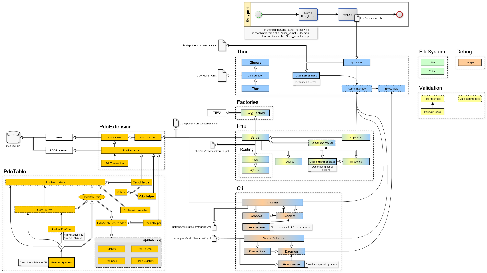
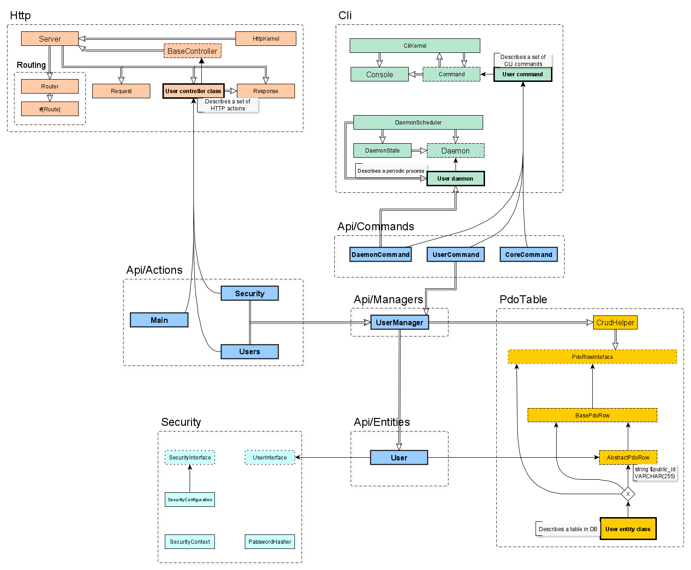

# Thor documentation
(WORK IN PROGRESS)

## Application

- [Entry points, Kernel and application](struct_entries.md)
  - [ⓘ How to : create a custom kernel](struct_entries.md#custom-kernels)
  - [CLI commands entry point](struct_entries.md#cli-entry-point) (todo)
  - [CLI daemons entry point](struct_entries.md#the-daemonscheduler) (todo)
  - [HTTP entry point](struct_entries.md#the-http-entry-point) (todo)

- [Resources](struct_resources.md) : configuration, static data and views.
  - [ⓘ How to : read a configuration/resource file](struct_resources.md#how-to-read-a-yaml-resource-file-)
  
- Variable files (todo)
  - Cache (todo)
  - Logs (todo)

## Thor libraries



- [Database](thor_database.md)
  - [Database configuration](thor_database.md#database-configuration)
  - [PdoExtension](thor_database.md#pdoextension-public-api)
  - [PdoTable](thor_database.md#pdotable-public-api)
  - [ⓘ How to : create an user class linked to a table](thor_database.md#example--create-a-user-class-linked-to-a-table-in-db)  
    > Use ```CrudHelper``` to create a DAO easily.
- [Http module](thor_http.md) and [routing](thor_routing.md)
- [Cli module](thor_cli.md)
    - [Console utility class](thor_cli.md#console-class-final)
    - [Create a daemon](thor_cli.md#example--create-a-daemon-and-cron-daemonscheduler)
    - [ⓘ How to : define a command](thor_cli.md#how-to-define-a-command-)
- Logger (todo)
- Extend Twig and Html utilities (todo)
- Security (todo)
- Validation utilities (todo)

## Thor API


