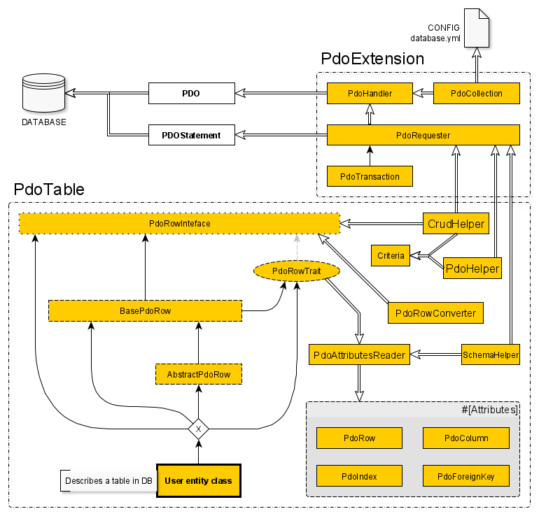

# Thor database module

The **database** module is divided in 2 submodules :

* ```PdoExtension``` which provides a way to easily connect and request a database.
* ```PdoTable``` which is analog as a light ORM.



## Pdo extension submodule

This submodule goal is to provide a stable API to connect a database and send SQL queries easily.

### PdoExtension public API

#### PdoHandler ```class``` ```final```

This class goal is to handle a PDO constructor parameters set and construct it on demand.

* ```__construct(string $dsn, ?string $user = null, ?string $password = null, int $defaultCase = PDO::CASE_NATURAL)```
* ```getPdo(): PDO```

The PDO object is created with these options :

```php
[
    PDO::ATTR_CASE => $this->defaultCase,
    PDO::ATTR_DEFAULT_FETCH_MODE => PDO::FETCH_ASSOC,
    PDO::ATTR_ERRMODE => PDO::ERRMODE_EXCEPTION
]
```

#### PdoCollection ```class``` ```final```

This class is a collection of ```PdoHandler```. It can be constructed from ```thor/app/res/config/database.yml```.

* ```__construct()```
* ```static createFromConfiguration(array $dbConfig): PdoCollection```
* ```add(string $connectionName, PdoHandler $handler): void```
* ```get(string $connectionName = 'default'): ?PdoHandler```
* ```all(): array```

#### PdoRequester ```class```

This class executes a request or performs a request and returns a result as a native ```PDOStatement```.

* ```__construct(PdoHandler $handler)```
* ```getPdoHandler(): PdoHandler```
* ```execute(string $sql, array $parameters): bool```
* ```executeMultiple(string $sql, array $parameters): bool```
* ```request(string $sql, array $parameters): PDOStatement```

#### PdoTransaction ```class``` ```final``` ```extends PdoRequester```

Can replace a ```PdoRequester``` anywhere to send queries as an SQL Transaction if the used driver supports it.

* ```__construct(PdoHandler $handler, bool $autoTransaction = true)```
* ```__destruct()```
* ```begin(): void```
* ```commit(): void```
* ```rollback(): void```

### Database configuration

The database configuration file is ```thor/app/res/config/database.yml```.  
This file contains all DB connections information as DSN, user and password.

For each DB connection, add an entry :

```yaml
db-connection-identifier:
    dsn: "driver:dsn"
    user: db-user
    password: db-password
    case: upper | lower | [natural]
```

### Handle configuration and request DB

```php
// Retrieve all connection information
use Thor\Thor;
use Thor\Database\PdoExtension\PdoCollection;
$pdoCollection = PdoCollection::createFromConfiguration(Thor::config('database'));

// Send a query to the DBMS :
use Thor\Database\PdoExtension\PdoRequester;
$pdoHandler = $pdoCollection->get('db-connection-identifier');
$requester = new PdoRequester($pdoHandler); // Use PdoTransaction instead of PdoRequester to perform
                                            // the queries in a transaction.
$result = $requester->request('SELECT * FROM User WHERE id=?', ['1'])->fetchAll();
```

#### Controllers and commands shortcuts

In a controller extending ```Thor\Http\BaseController```:

```php
$pdoHandler = $this->getServer()->getHandler('db-connection-identifier');
$requester = new PdoRequester($pdoHandler);
```

In a command extending ```Thor\Cli\Command``` :

```php
$pdoHandler = $this->cli->pdos->get('db-connection-identifier');
$requester = new PdoRequester($pdoHandler);
```

## PdoTable submodule

This submodule goal is to provide a stable API for MySql/MariaDB only (for now).  
With these classes, you can define [Data Access Objects](https://en.wikipedia.org/wiki/Data_access_object) easily.

### PdoTable public API

#### PdoRowInterface ```interface```

Define a PdoRow class contract.

* ```static getTableDefinition(): PdoRow```
* ```static getPdoColumnsDefinitions(): array```
* ```static getPrimaryKeys(): array```
* ```static getIndexes(): array```
* ```toPdoArray(): array```
* ```fromPdoArray(array $pdoArray): void```
* ```getPrimary(): array```
* ```getPrimaryString(): string```

#### AdvancedPdoRow ```trait``` ```implements PdoRowInterface```

Bind a table to a class with PHP attributes.

* ```__construct(array $primaries = [])```
* ```final static getTableDefinition(): PdoRow```
* ```final static getPdoColumnsDefinitions(): array```
* ```final static getPrimaryKeys(): array```
* ```final static getIndexes(): array```
* ```final toPdoArray(): array```
* ```final fromPdoArray(array $pdoArray): void```
* ```final getPrimary(): array```
* ```final getPrimaryString(): string```

#### AbstractPdoRow ```class``` ```abstract``` ```use AdvancedPdoRow```

Defines a ```public_id``` column.

* ```__construct(?string $public_id = null, array $primaries = [])```
* ```getPublicId(): ?string```
* ```generatePublicId(): void```

#### Attributes

* ```#[PdoRow]```
    * ```?string $tableName = null```
    * ```array $primary = []```
    * ```?string $auto = null```
* ```#[PdoColumn]```
    * ```string $name```
    * ```string $sqlType```
    * ```string $phpType```
    * ```bool $nullable = true```
    * ```mixed $defaultValue = null```
    * ```?callable $toSqlValue = null```
    * ```?callable $toPhpValue = null```
* ```#[PdoIndex]```
    * ```array $columnNames```
    * ```bool $isUnique = false```
    * ```?string $name = null```
* ```#[PdoForeignKey]```
    * ```string $className```
    * ```array $targetColumns```
    * ```array $localColumns```
    * ```?string $name = null```

#### PdoAttributesReader ```class``` ```final```

* ```__construct(private string $classname)```
* ```static pdoRowInfo(string $className): array```  
  ```#[ArrayShape(['row' => PdoRow::class, 'columns' => 'array', 'indexes' => 'array', 'foreign_keys' => 'array'])```
* ```getAttributes(): array```  
  ```#[ArrayShape(['row' => PdoRow::class, 'columns' => 'array', 'indexes' => 'array', 'foreign_keys' => 'array'])```

#### CrudHelper ```class``` ```final```

Performs SQL queries with a ```PdoRequester``` on a specified class implementing ```PdoRowInterface```.

* ```__construct(string $className, PdoRequester $requester)```
* ```static instantiateFromRow(string $className, array $row): mixed```
* ```table(): string```
* ```listAll(): array```
* ```createOne(PdoRowInterface $row): string```
* ```createMultiple(array $rows): bool```
* ```readOne(array $primaries): mixed```
* ```readOneBy(Criteria $criteria): mixed```
* ```readOneFromPid(string $pid): mixed```
* ```readMultipleBy(Criteria $criteria): array```
* ```updateOne(PdoRowInterface $row): bool```
* ```deleteOne(PdoRowInterface $row): bool```

#### Criteria ```class``` ```final```

* ```const GLUE_AND = true```
* ```const GLUE_OR = false```
* ```__construct(array $criteria = [], bool $glue = self::GLUE_AND)```
* ```static compile(array $criteria, bool $glue = self::GLUE_AND): array```  
  ```#[ArrayShape(['sql' => "string", 'params' => "array"])]```
* ```static getWhere(Criteria $criteria): string```
* ```getSql(): string```
* ```getParams(): array```

#### SchemaHelper ```class``` ```final```

* ```__construct(PdoRequester $requester, PdoAttributesReader $reader)```
* ```createTable(): bool```
* ```dropTable(): bool```

### Example : Create a User class linked to a table in DB

1. Create a class extending ```AdvancedPdoRow``` :

```php

namespace MyApp;

use Thor\Database\PdoTable\AbstractPdoRow;
use Thor\Database\PdoTable\Attributes\PdoRow;
use Thor\Database\PdoTable\Attributes\PdoColumn;
use Thor\Database\PdoTable\Attributes\PdoIndex;

/**
 * Class User
 *  + AbstractPdoRow:: #[PdoColumn('public_id', 'VARCHAR(255)', false)]
 *  + AbstractPdoRow:: #[PdoIndex(['public_id'], true)]
 * 
 * a convention : primary key columns, then indexes, with their columns, then the other columns
 * 
 */
#[PdoRow('user', ['id'], 'id')]
#[PdoColumn('id', 'INT', 'integer', false)]
#[PdoIndex(['username'], true)]
#[PdoColumn('username', 'VARCHAR(255)', 'string', false)]
#[PdoColumn('password', 'VARCHAR(255)', 'string', false)] // the hashed password
class User extends AbstractPdoRow
{

    public function __construct(
        protected string $username,
        protected string $password
    ) {
        parent::__construct(null, [null]);
    }
    
    public function setPassword(string $clearPassword): void
    {
        $this->password = password_hash($clearPassword, PASSWORD_DEFAULT);
    }
    
    /**
     * @return string
     */
    public  function getPassword(): string
    {
        return $this->password;
    }   
    
    /**
     * @param string $username
     */
    public function setUsername(string $username): void
    {
        $this->username = $username;
    }
    
    /**
     * @return string
     */
    public function getUsername(): string
    {
        return $this->username;
    }
    
}
```

2. Create the table :

```php

use MyApp\User;
use Thor\Database\PdoTable\SchemaHelper;
use Thor\Database\PdoTable\Attributes\PdoAttributesReader;

$schema = new SchemaHelper($this->getServer()->getRequester(), new PdoAttributesReader(User::class));
$schema->createTable(); // execute the CREATE TABLE query in DB.
```

```$schema->createTable()``` performs this SQL query :

```mysql
CREATE TABLE user
(
    id        INTEGER      NOT NULL AUTO_INCREMENT,
    public_id VARCHAR(255) NOT NULL,
    username  VARCHAR(255) NOT NULL,
    password  VARCHAR(255) NOT NULL,

    PRIMARY KEY (id),
    CONSTRAINT UNIQUE INDEX uniq_public_id (public_id),
    CONSTRAINT UNIQUE INDEX uniq_username (username)
)
```

3. Use it !

```php

use MyApp\User;
use Thor\Database\PdoTable\CrudHelper;
use Thor\Http\BaseController;

class Anywhere extends BaseController {
    public function doSomething(): void
    {
        $crud = new CrudHelper(User::class, $this->getServer()->getRequester());
        
        // here $myUser->getPublidId() === null && $myUser->getPrimaryString() === ''
        $pid = $crud->createOne($myUser = new User(null, [null]));
        
        // here $myUser->getPublidId() === 'a random string'
        //   && $myUser->getPrimaryString() === '1' (the auto_increment value)
        $myUser = $crud->readOneFromPid($pid);
    }
}
```
